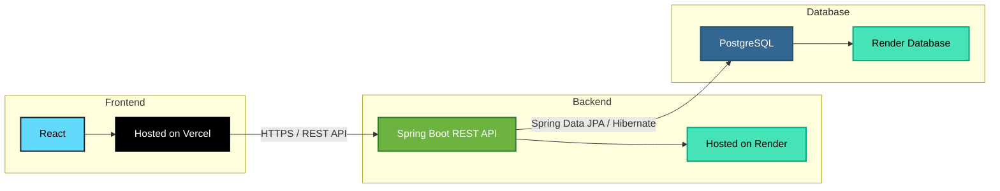

# URL Shortener

A production-deployed, full-stack URL shortening service built with Java Spring Boot and React. Developed as a portfolio project to demonstrate backend engineering, containerization, and cloud deployment skills.

🔗 **Live Application:** [url6604.vercel.app](https://url6604.vercel.app)  
📁 **Repository:** [github.com/SaiGargey/url-shortener](https://github.com/SaiGargey/url-shortener)

---

## Tech Stack

| Layer | Technology |
|-------|------------|
| Backend | Java 17, Spring Boot 4.x |
| Database | PostgreSQL 15 |
| ORM | Spring Data JPA, Hibernate |
| Frontend | React 18, Vite, Tailwind CSS |
| Containerization | Docker, Docker Compose |
| Backend Hosting | Render |
| Frontend Hosting | Vercel |

---

## Features

- **URL Shortening** — Converts long URLs into short, Base62-encoded codes
- **Duplicate Detection** — Identical URLs return the same short code rather than creating duplicates
- **Click Tracking** — Every redirect increments a click counter stored in the database
- **HTTP 302 Redirect** — Ensures every visit is tracked server-side rather than cached by the browser
- **Input Validation** — URL format validation on both the client and server

---

## System Design

### URL Generation Strategy
Short codes are generated using Base62 encoding on the auto-incremented database ID. This guarantees uniqueness without collision handling, produces short and URL-safe codes, and allows the code length to grow naturally as the ID increases.

## Project Architecture



### Redirect Flow
1. Client submits a long URL via `POST /api/shorten`
2. Service checks if the URL already exists in the database
3. If new — persists the record, encodes the generated ID in Base62, updates the short code
4. Returns the short URL to the client
5. Client visits `GET /{code}` — server looks up the original URL, increments click count, returns HTTP 302

### Why 302 over 301
A 301 (Permanent) redirect is cached by browsers, meaning subsequent visits bypass the server entirely — making click tracking inaccurate. A 302 (Temporary) redirect ensures every visit hits the server, preserving analytics integrity.

---

## Running Locally

### Prerequisites
- Java 17
- Docker and Docker Compose
- Node.js 20+

### Backend
```bash
# Clone the repository
git clone https://github.com/SaiGargey/url-shortener.git
cd url-shortener

# Start the application and database
docker compose up --build
```
Backend available at `http://localhost:8081`

### Frontend
```bash
cd frontend
npm install
npm run dev
```
Frontend available at `http://localhost:5173`

---

## API Reference

| Method | Endpoint | Description | Request Body |
|--------|----------|-------------|--------------|
| `POST` | `/api/shorten` | Shorten a URL | `{ "url": "https://example.com" }` |
| `GET` | `/{code}` | Redirect to original URL | — |
| `GET` | `/api/urls` | Retrieve all shortened URLs | — |

---

## Project Structure

```text
url-shortener/
├── src/
│   └── main/java/com/url/url_shortner/
│       ├── controller/
│       ├── service/
│       ├── repository/
│       ├── model/
│       └── config/
├── frontend/
│   └── src/
│       └── App.jsx
├── Dockerfile
├── docker-compose.yml
└── README.md
```

### Directory Overview

| Directory/File | Purpose |
|----------------|---------|
| `controller/` | REST API endpoints |
| `service/` | Business logic and Base62 encoding |
| `repository/` | Spring Data JPA repositories |
| `model/` | JPA entity classes |
| `config/` | CORS and application configuration |
| `frontend/` | React frontend |
| `Dockerfile` | Multi-stage Docker build |
| `docker-compose.yml` | Runs the application with PostgreSQL |

---

## Author

**Sai Gargey Nakka**  
B.Tech Computer Science — KMIT, Hyderabad  
[GitHub](https://github.com/SaiGargey) · [LinkedIn](https://www.linkedin.com/in/n-sai-gargey-18773b29a/)